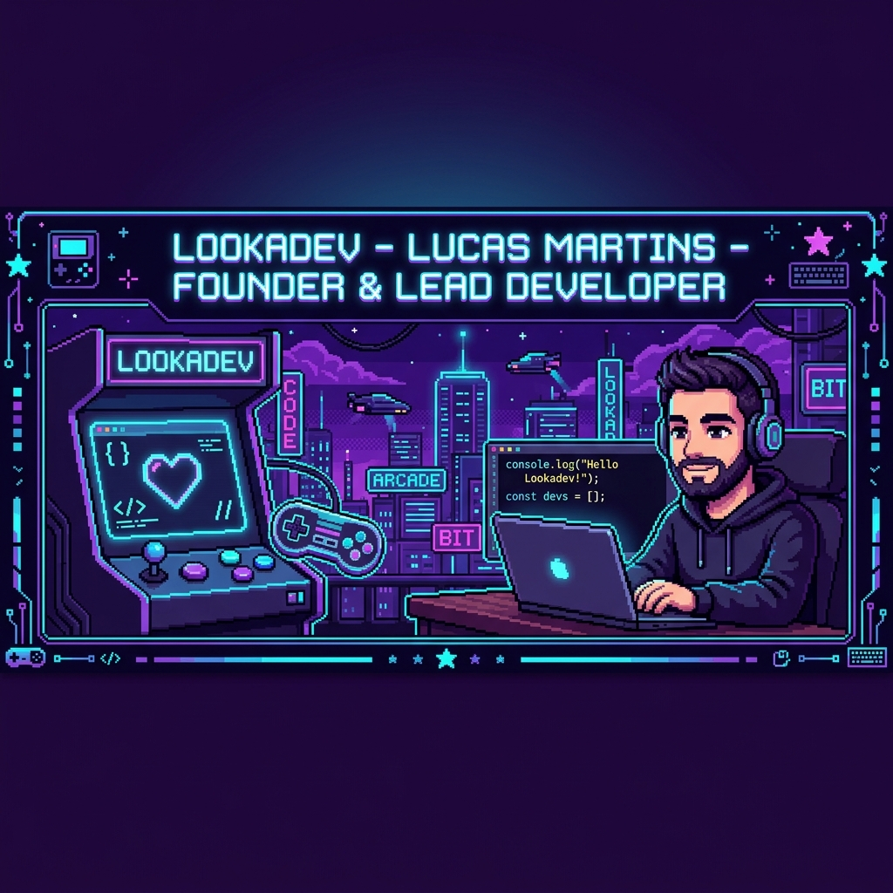
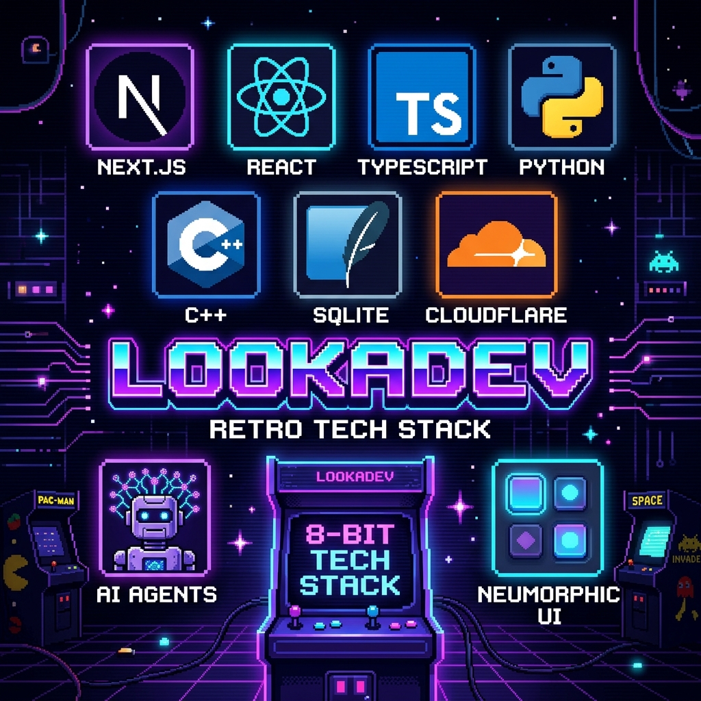

  

  

  
  
  
  

---

### 🕹️ Sobre Mim & LOOKADEV

> **"Transformando ideias em ecossistemas digitais de alta performance, com design intuitivo e IA previsível."**

Sou o **Desenvolvedor Fundador da LOOKADEV**, onde crio produtos digitais de elite combinando **Engenharia Fullstack**, **Workflows de IA de Alta Eficiência**, **Otimização em Baixo Nível (C++)** e uma identidade visual marcante com **Neumorfismo**, **Glow Neon** e **Pixel Art Retro**.

- 🚀 **Fundador & Lead Engineer** na [LOOKADEV](#-projetos-em-destaque) - Desenvolvimento de SaaS, PWAs e Automação com IA.
- 👾 **Marca Registrada**: Interfaces fluidas com Neumorfismo (Soft Shadows/Glassmorphism) e toque Retrô Pixel Art 8-bit.
- ⚡ **Engenharia de Alta Performance**: Aplicações Next.js 16 / React 19, Cloudflare Edge + Turso (LibSQL), e otimização nativa em C++.
- 🤖 **Pioneiro em AI Workflows**: Criador do [Agentic Prompt Intake](https://github.com/vetlucasmartins/agentic-prompt-intake) e [Local Context Compiler (LCC)](https://github.com/vetlucasmartins/lcc) para eficiência de tokens e IA determinística.

---

### 👾 Tech Stack & Assinatura Visual

  

<table align="center">
  <tr>
    <td width="50%" valign="top">
      <h4>🎨 Frontend & UI/UX (Neumorphic System)</h4>
      <ul>
        <li><b>Frameworks:</b> Next.js 16, React 19, Vite, Flutter</li>
        <li><b>Linguagens:</b> TypeScript, JavaScript (ES2024), HTML5</li>
        <li><b>Estilização:</b> Vanilla CSS3, Tailwind CSS, Glassmorphism</li>
        <li><b>Design:</b> Neumorfismo Soft UI, Pixel Art 8-bit, Design Tokens</li>
      </ul>
    </td>
    <td width="50%" valign="top">
      <h4>⚡ Backend & Edge Databases</h4>
      <ul>
        <li><b>Edge & Serverless:</b> Cloudflare Workers, Node.js, Express</li>
        <li><b>Databases:</b> Turso (LibSQL/SQLite Edge), SQLite, PostgreSQL</li>
        <li><b>Sistemas & Low-Level:</b> C++20, Dart FFI, Native Assets</li>
        <li><b>APIs:</b> REST, GraphQL, FTS5 Search, Stateless JWT</li>
      </ul>
    </td>
  </tr>
  <tr>
    <td width="50%" valign="top">
      <h4>🤖 AI Engineering & Agents</h4>
      <ul>
        <li><b>Intake Protocol:</b> Agentic Prompt Intake (Anamnese)</li>
        <li><b>Token Optimization:</b> LCC (Local Context Compiler)</li>
        <li><b>Frameworks AI:</b> Google Antigravity SDK, LangChain</li>
        <li><b>Modelos:</b> Gemini 1.5/2.0, Claude 3.5, OpenAI GPT-4o</li>
      </ul>
    </td>
    <td width="50%" valign="top">
      <h4>🧪 Qualidade, Testes & DevOps</h4>
      <ul>
        <li><b>Testes:</b> Vitest, Playwright E2E, Unit Testing</li>
        <li><b>Qualidade:</b> ESLint, Prettier, Zod Schema Boundaries</li>
        <li><b>DevOps:</b> Git, GitHub Actions CI/CD, Vercel, Docker</li>
        <li><b>Segurança:</b> Security Headers, Input Sanitation, Rate Limiting</li>
      </ul>
    </td>
  </tr>
</table>

  
  
  
  
  
  
  
  

---

### 🔮 Projetos em Destaque (LOOKADEV & Open Source)

| Projeto | Categoria | Descrição & Diferencial Tecnológico |
| :--- | :---: | :--- |
| 💎 **LOOKADEV Ecosystem** | `SaaS / Studio` | Plataforma principal de soluções digitais premium, combinando landing pages neomórficas, PWAs e automação com IA. |
| 🎮 **Moonlight Switch Optimization** | `C++ / Game Tech` | Otimização de baixa latência e refatoração de threading para streaming 60fps no Nintendo Switch (Borealis C++). |
| 🍷 [**Sommelier Vinhos PWA**](https://github.com/vetlucasmartins/sommeliervinhos) | `PWA & AI` | App PWA Zero-Scroll com experiência dupla (Mascote interativo vs Busca direta) + Landing Page Neomórfica de Vendas. |
| 🧠 [**Agentic Prompt Intake**](https://github.com/vetlucasmartins/agentic-prompt-intake) | `AI Agents` | Protocolo portátil de anamnese e refinamento de requisitos para agentes de IA antes de execuções de código. |
| 📦 [**Local Context Compiler (LCC)**](https://github.com/vetlucasmartins/lcc) | `AI Tooling` | Engine em Python para otimização determinística de contexto e redução de custo de tokens em LLMs. |
| 💼 **Piquet Partners & Cetro Hub** | `Enterprise` | Plataforma operacional restrita para parceiros do Piquet Group e app de missões diárias com pipeline prioritário. |
| 📑 [**ContentRepurpose Studio**](https://github.com/vetlucasmartins/contentrepurpose-studio) | `Next.js 16` | Workspace Next.js 16 / React 19 para reaproveitamento de conteúdo com formulários Zod e persistência local. |

---

### 📊 Estatísticas do GitHub

  
  &nbsp;&nbsp;
  

  

---

### 💡 Filosofia de Desenvolvimento LOOKADEV

1. **Pixel-Perfect Aesthetics & Neumorphism**: Uma primeira impressão deslumbrante é indispensável. Interfaces devem ser vívidas, responsivas e elegantes.
2. **Local-First & Transparência em IA**: A IA deve ser uma camada previsível e auditável com validações rigorosas (Zod schemas, mocks determinísticos e contexto estruturado).
3. **Engenharia de Qualidade**: Código limpo, testado com Vitest/Playwright, sem suprimir erros ou deixar pontas soltas.

---

### 📫 Conecte-se comigo

  
  
  

  ⚡ <b>LOOKADEV</b> — High Performance Engineering & Modern Neumorphic Design | Handcrafted by Lucas Martins

