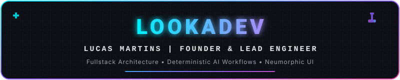
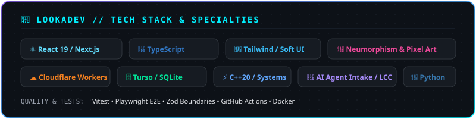

  

  
  
  
  

---

### 🕹️ Sobre Mim & LOOKADEV

> **"Transformando ideias em ecossistemas digitais de alta performance, com design intuitivo e IA previsível."**

Desenvolvedor e **Fundador da LOOKADEV**, focado em engenharia de produtos digitais de alta performance, unindo **Engenharia Fullstack**, **Automação de IA**, **Otimização em Baixo Nível (C++)** e uma identidade visual refinada em **Neumorfismo** e **Pixel Art**.

- 🚀 **Founder & Lead Engineer** na **LOOKADEV** — SaaS, PWAs, Soluções de IA e Estúdio de Design.
- 👾 **Identidade Visual**: Interfaces fluidas com Neumorfismo (Soft UI/Glassmorphism) e retrô 8-bit accents.
- ⚡ **Performance & Edge**: Next.js 16, React 19, Cloudflare Workers, Turso (LibSQL/SQLite) e otimizações nativas em C++.
- 🤖 **Engenharia de IA**: Criador do [Agentic Prompt Intake](https://github.com/vetlucasmartins/agentic-prompt-intake) e [Local Context Compiler (LCC)](https://github.com/vetlucasmartins/lcc).

---

### 👾 Tech Stack & Especialidades

  

  

---

### 🔮 Projetos em Destaque (LOOKADEV & Open Source)

| Projeto | Categoria | Descrição & Diferencial Tecnológico |
| :--- | :---: | :--- |
| 💎 **LOOKADEV Ecosystem** | `SaaS / Studio` | Plataforma de soluções digitais premium, combinando landing pages neomórficas, PWAs e automação com IA. |
| 🎮 **Moonlight Switch Optimization** | `C++ / Game Tech` | Refatoração de threading e otimização para game streaming a 60fps sem oscilação no Nintendo Switch (Borealis C++). |
| 🍷 [**Sommelier Vinhos PWA**](https://github.com/vetlucasmartins/sommeliervinhos) | `PWA & AI` | App PWA Zero-Scroll com assistente sommelier conversacional + Landing Page Neomórfica de Vendas. |
| 🧠 [**Agentic Prompt Intake**](https://github.com/vetlucasmartins/agentic-prompt-intake) | `AI Agents` | Protocolo portátil de anamnese e refinamento de requisitos para agentes de IA antes da execução de código. |
| 📦 [**Local Context Compiler (LCC)**](https://github.com/vetlucasmartins/lcc) | `AI Tooling` | Engine CLI em Python para otimização determinística de contexto e economia de tokens em LLMs. |
| 💼 **Piquet Partners & Cetro Hub** | `Enterprise` | Plataforma de operações de parceiros imobiliários do Piquet Group e app de missões com pipeline prioritário. |

---

### 📊 Estatísticas

  
  &nbsp;&nbsp;
  

---

### 📫 Conecte-se

  
  &nbsp;
  
  &nbsp;
  

  ⚡ <b>LOOKADEV</b> — High Performance Engineering &amp; Neumorphic Design | Lucas Martins

